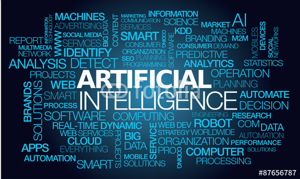

**RESUME PERTEMUAN 1 KECERDASAN BUATAN**

  

**Latar Belakang Masalah**

Kecerdasan buatan adalah simulasi proses kecerdasan manusia dengan mesin, terutama sistem komputer. Proses ini termasuk belajar (perolehan informasi dan aturan untuk menggunakan informasi), penalaran (menggunakan aturan untuk mencapai kesimpulan perkiraan atau pasti), dan koreksi diri. aplikasi tertentu AI termasuk sistem pakar, pengenalan suara dan visi mesin Rekayasa pengetahuan adalah bagian inti dari penelitian AI.AI biasanya dihubungkan dengan Ilmu Komputer, akan tetapi juga terkait erat dengan bidang lain seperti matematika, msikologi, pengamatan,Filosofi, dan yang lainnya.

AI biasanya dihubungkan dengan Ilmu Komputer, akan tetapi juga terkait erat dengan bidang lain seperti matematika, msikologi, pengamatan,Filosofi, dan yang lainnya. Pengertian lain dari kecerdasan buatan adalah bagian ilmu komputer yang membuat agar mesin komputer dapat melakukan pekerjaan seperti yang dilakukan manusia. Pada awal diciptakan, komputer hanya berfung sebagai alat hitung saja. Namun seiring dengan perkembangan jaman, maka peran komputer semakin mendominasi kehidupan manusia.

1. Apa pengertian kecerdasan buatan?
2. Apa saja jenis-jenis kecerdasan buatan?
3. Apa saja keuntungan-keuntungan kecerdasan buatan?
4. Bagaimana teori kecerdasan buatan?

**PEMBAHASAN**

**Kecerdasan buatan adalah** bagian ilmu komputer yang membuat agar mesin komputer dapat melakukan pekerjaan seperti dan sebaik yang dilakukan manusia.

**Jenis-jenis kecerdasan buatan ,** jenis pertama yaitu mesin reaktif, jenis kedua yaitu memori terbatas, jenis ketiga yaitu teori pikiran, dan jenis keempat yaitu kesadaran diri.

**Keuntungan-keuntungan kecerdasan buatan yaitu** kecerdasan buatan memiliki sifat permanen,lebih mudah di publikasi dan disebarkan,bersifat konsisten,dapat didokumentasikan serta dapat melakukan pekerjaan dengan baik dan cepat.

**Teori kecerdasan buatan:**

1. Efisien

Efisien lebih kearah melakukan sesuatu dengan benar atau bisa dikatakan tepat guna

2. Efektif

melakukan sesuatu yang sesuai dengan apa yang diinginkan atau tapat sasaran atau bisa juga di artikan melakukan sesuatu yang benar.

**PENUTUP**

**KESIMPULAN**

Dari penjelasan-penjelasan diatas dapat disimpulkan bahwa kecerdasan buatan adalah bagian ilmu komputer yang membuat agar mesin komputer dapat melakukan pekerjaan seperti dan sebaik yang dilakukan manusia. Kecerdasan  buatan  mempunyai teori yaitu efisien dan efektif,efisien yaitu lebih kearah melakukan sesuatu dengan benar atau bisa dikatakan tepat guna sedangkan efektif yaitu melakukan sesuatu yang sesuai dengan apa yang diinginkan atau tapat sasaran atau bisa juga di artikan melakukan sesuatu yang benar.

**SARAN**

Saran yang dapat diberikan yaitu agar dapat memperdalam lagi materi mengenai kecerdasan buatan dengan membaca berbagai sumber lainnya.

link github: https://github.com/D4TI3C/Yanda-Rizky-Prasetiya-1144004

Nama : yanda rizky prasetiya

NPM : 1144004

Kelas : 3C

Prodi : D4 Teknik Informatika

Mata Kuliah : Kecerdasan Buatan

link mata kuliah: http://kampus.awangga.net/home/kelassistemmultimediadankecerdasanbuatan2017

referensi: https://id.wikipedia.org/wiki/Kecerdasan_buatan

Scan plagiarisme:

1. https://drive.google.com/open?id=0ByZqhNt9UFJ2ekhOdFlaeTVvajQ

2. https://drive.google.com/open?id=0ByZqhNt9UFJ2UlpCRHJaTUVoUVE