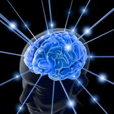

**RESUME PERTEMUAN 2 KECERDASAN  BUATAN**

  

**LATAR BELAKANG**

1. Apakah yang dimaksud dengan Representasi Pengetahuan?
2. Apakah yang dimaksud Presentasi?
3. Apakah yang dimaksud Pengtahuan?
4. Apa perbedaan antara tahu dan paham?
5. Apakah yang dimaksud dengan fakta?

**ISI**

**Representasi Pengetahuan adalah** suatu cara yang digunakan untuk menyajikan pengetahuan yang diperoleh, ke dalam suatu skema tertentu sehingga dapat diketahui dengan jelas relasi antara suatu pengetahuan dengan pengetahuan yang lain yang kemudian dapat dipakai untuk menguji kebenaran penalarannya.

**Presentasi adalah** suatu kegiatan memaparkan atau memberi informasi dan gagasan dengan menggunakan bantuan symbol-simbol,gambar,grafis angka dan lain sebagainya dari seorang pembicara kepada audiens.

**Pengetahuan adalah** sesuatu berupa informasi yang hadir dan terwujud dalam jiwa dan pikiran seseorang .

**Perbedaan antara tahu dan paham yaitu** jika kita tahu belum tentu kita paham, sedangkan jika kita paham udah pasti kita tahu. Proses yang mengubah tahu menjadi paham adalah Berfikir, karena dengan berfikir kita dapat menjadi paham apa yang kita tahu.

**Fakta adalah** suatu hal,peristiwa,kejadian yang terjadi secara nyata dan sesuatu yang benar-benar terjadi. Contoh : Yanda adalah laki – laki. Jika di bahasa pemrograman contohnya : laki – laki (Yanda).

**PENUTUP**

**KESIMPULAN**

Kesimpulan yang dapat diambil dari penjelasan-penjelasan diatas yaitu Representasi Pengetahuan adalah suatu cara yang digunakan untuk menyajikan pengetahuan yang diperoleh, ke dalam suatu skema tertentu sehingga dapat diketahui dengan jelas relasi antara suatu pengetahuan dengan pengetahuan yang lain yang kemudian dapat dipakai untuk menguji kebenaran penalarannya.

**SARAN**

Saran yang dapat diberikan yaitu agar dapat mempelajari lebih dalam lagi mengenai representasi pengetahuan agar semakin paham teori-teori yang terdapat didalamnya.

link github: https://github.com/D4TI3C/Yanda-Rizky-Prasetiya-1144004

Nama : yanda rizky prasetiya
   
NPM : 1144004

Kelas : 3C

Prodi : D4 Teknik Informatika

Mata Kuliah : Kecerdasan Buatan

link mata kuliah: http://kampus.awangga.net/home/kelassistemmultimediadankecerdasanbuatan2017

referensi: http://spukswkelasbkelompok3.blogspot.co.id/2009/02/pengetahuan-dibedakan-menjadi-3.html

Scan plagiarisme:

1. https://drive.google.com/open?id=0ByZqhNt9UFJ2dHpQd3NOeU1XWGM

2. https://drive.google.com/open?id=0ByZqhNt9UFJ2UlpCRHJaTUVoUVE